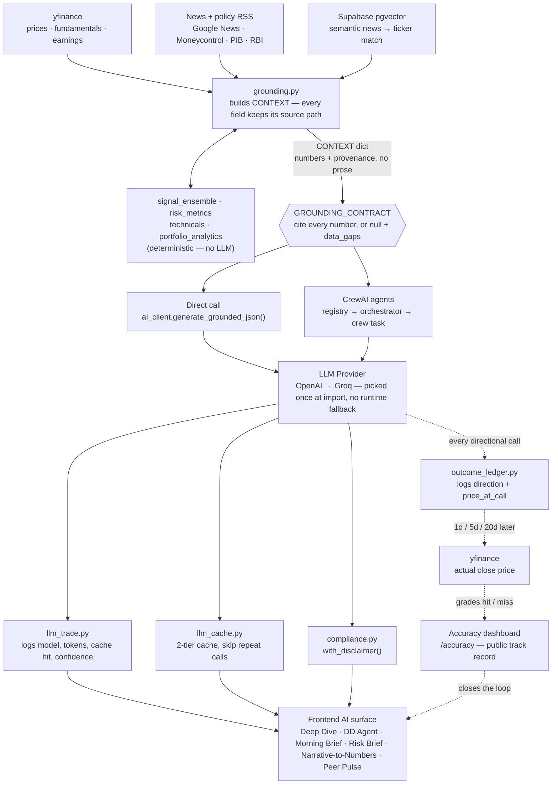

# FinContext

AI-powered contextual analysis for Indian equities (NSE). FastAPI backend +
Next.js frontend + Supabase (Postgres, pgvector, auth).

Full engineering rules for AI-touching code: [AGENTS.md](./AGENTS.md).
Product/compliance roadmap: [STRATEGY.md](./STRATEGY.md).

## AI architecture

FinContext runs two parallel AI-calling systems on top of one shared
discipline: **the model never computes or invents a number — it only
narrates one that a deterministic service already produced.** Every claim
either cites a path in a `CONTEXT` dict or comes back `null` with an entry
in `data_gaps`. That rule is called the `GROUNDING_CONTRACT`, and it's the
one constant across both calling conventions below.



A more detailed, annotated version of this same diagram (with a two-systems
comparison table and the known-gaps list) is published as an
[architecture artifact](https://claude.ai/code/artifact/6ffc72ab-2190-4ee5-a6b0-f195869efb6d).

### Two systems, one contract

The CrewAI agent migration is mid-flight — worth knowing which flows are on
which side before changing either.

| | Direct — `ai_client.py` | Agents — CrewAI |
|---|---|---|
| Entry point | `generate_grounded_json()` | `registry` → `orchestrator.run_cached()` → crew task |
| Used by | Deep Dive · DD Agent · Simulator · Morning Brief · News Feed · Market Summary | Narrative-to-Numbers · Risk Brief |
| LLM round-trips | 1 per call (+1 optional `verify_claims` pass) | 2 sequential agents (extract → quantify), or 1 for Risk Brief |
| Caching | `response_cache` / ad hoc TTL caches | `llm_cache`, wrapped automatically by the orchestrator |
| Status | primary workhorse today | 2 of ~7 flows moved; `Equity Researcher` / `Synthesizer` agents exist but aren't wired to a router yet |

### Known gaps

- **No runtime provider fallback.** OpenAI/Groq is picked once at import in
  `ai_client.py`; `agents/base.py` hard-requires Groq independently. One
  provider outage takes down the whole AI surface.
- **Config sprawl.** Six-plus modules each run their own `load_dotenv()` +
  `os.getenv()` instead of one settings object owning AI/Supabase config.
- **Migration paused mid-flight.** Only Narrative-to-Numbers and Risk Brief
  run on CrewAI; the direct-call path duplicates the same grounding
  discipline by hand.
- **Two files own most of the surface.** `portfolio_intelligence.py`
  (2,255 lines) and `analysis.py` (871 lines) each bundle several unrelated
  AI flows together.

## Quickstart

```bash
# backend
cd backend
python -m venv venv && venv\Scripts\activate   # Windows
pip install -r requirements.txt
uvicorn app.main:app --reload --port 8000
python -m pytest tests/ -q                      # unit + grounding evals

# frontend
cd frontend
npm install
npm run dev
```

Required env vars: see `backend/.env.example` and `frontend/.env.example`.

## Repo layout

```
backend/app/
  routers/        FastAPI endpoints
  services/        ai_client, grounding, llm_cache, llm_trace, vector_store,
                   signal_ensemble, outcome_ledger, ...
  agents/          CrewAI agent definitions, tools, orchestrator, crews
  core/            compliance disclaimers, settings, security
backend/tests/     evals/ — grounding regression tests (see AGENTS.md)
frontend/src/app/  Next.js app router — one component per AI surface
supabase/          SQL migrations (RLS, pgvector, outcome ledger, ...)
scripts/           ops cron scripts (daily outcome scoring, morning brief)
```
